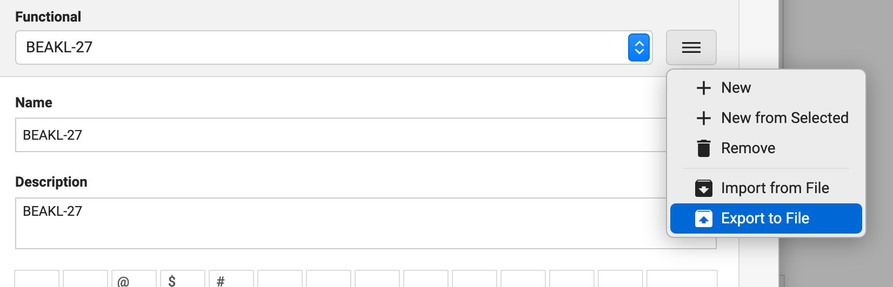

# TypeFu Alternative Layouts

[Type Fu](https://type-fu.com/) is an great touch typing practice software / web-app, that is now available for free!

The advantage is that you can feed any keyboard layout to the app and it will help you train your finger memory to type on that keyboard layout.

It has a variety of features as well that shows your progression and performance while learning to touch type.

This repo contains some of the alternative keyboard layouts that I have been learning which are not present in the TypeFu app out of the box.

## Added Layouts

Colemak-DH
BEAKL 15
BEAKL 15-27
BEAKL 27
BEAKL 27-A
BEAKL 30
BEAKL 30-HK

To use, just download the required layout file and import into TypeFu. You can also export layouts that you have created or modified.

Have fun learning to touch type!
